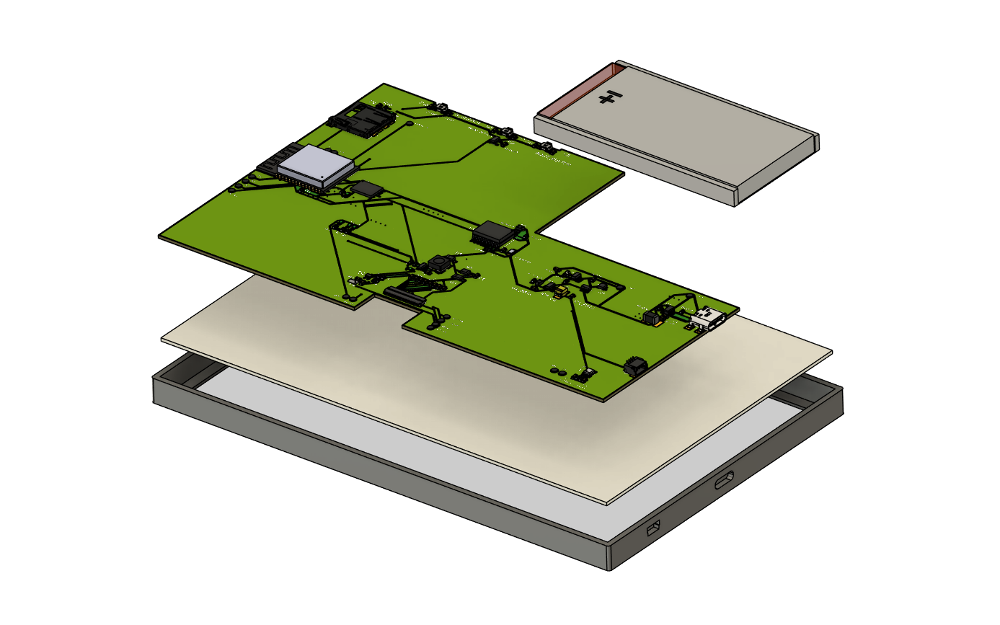

# OpenBook E-Reader
Maholea Elena-Alexia, 333CD

## Viziune de ansamblu a proiectului

## Schema bloc

# Bill of Materials
|**Part Name**                                               | **Check Price** | **DataSheet** |
|-------------------------------------------------------------|------------------|---------------|
|BUTTON| [Check Price](https://industry.panasonic.com/global/en/products/control/switch/light-touch/number/evqpuj02k)     |   [DataSheet](https://industry.panasonic.com/global/en/products/control/switch/light-touch/number/evqpuj02k)      
| ESP32_WROVER_EAGLE-LTSPICE_CC0402                          | [Check Price](https://componentsearchengine.com/part-view/CC0402MRX5R5BB106/YAGEO)      | [DataSheet](https://componentsearchengine.com/part-view/CC0402MRX5R5BB106/YAGEO)   |
|CPH3225A                                                    | [Check Price](https://www.snapeda.com/parts/CPH3225A/Seiko+Instruments/view-part/?ref=eda)      | [DataSheet](https://www.snapeda.com/parts/CPH3225A/Seiko+Instruments/view-part/?ref=eda)     |
|ADAFRUIT_LEDCHIP-LED0603                                    | [Check Price](https://www.snapeda.com/parts/KP-1608SURCK/Kingbright/view-part/?ref=search&t=LED%200603)      | [DataSheet]()     |
|USBLC6-2SC6Y                                                | [Check Price](https://www.google.com/url?q=https://www.snapeda.com/parts/USBLC6-2SC6Y/STMicroelectronics/view-part/?ref%3Deda&sa=D&source=editors&ust=1743979629785640&usg=AOvVaw2X7DsyD0aSaihvCPkvpMcS)      | [DataSheet](https://www.google.com/url?q=https://www.snapeda.com/parts/USBLC6-2SC6Y/STMicroelectronics/view-part/?ref%3Deda&sa=D&source=editors&ust=1743979629785640&usg=AOvVaw2X7DsyD0aSaihvCPkvpMcS)     |
|MBR0530                                                     | [Check Price](https://www.google.com/url?q=https://eu.mouser.com/ProductDetail/KYOCERA-AVX/SD0805S020S1R0?qs%3DjCA%25252BPfw4LHbpkAoSnwrdjw%253D%253D&sa=D&source=editors&ust=1743979672575299&usg=AOvVaw260GDj91204P1ItqGdSVkk)      | [DataSheet](https://www.google.com/url?q=https://eu.mouser.com/ProductDetail/KYOCERA-AVX/SD0805S020S1R0?qs%3DjCA%25252BPfw4LHbpkAoSnwrdjw%253D%253D&sa=D&source=editors&ust=1743979672575299&usg=AOvVaw260GDj91204P1ItqGdSVkk)     |
|PGB1010603MR                                                | [Check Price](https://www.snapeda.com/parts/PGB1010603MR/Littelfuse/view-part/?ref=eda)      | [DataSheet](https://www.snapeda.com/parts/PGB1010603MR/Littelfuse/view-part/?ref=eda)     |
| ESP32_WROVER_AVX---SD0805S020S1R0_AVX_...                  | [Check Price](https://eu.mouser.com/ProductDetail/KYOCERA-AVX/SD0805S020S1R0?qs=jCA%252BPfw4LHbpkAoSnwrdjw%3D%3D)      | [DataSheet](https://eu.mouser.com/ProductDetail/KYOCERA-AVX/SD0805S020S1R0?qs=jCA%252BPfw4LHbpkAoSnwrdjw%3D%3D)     |
| PGB1010603MR                                                | [Check Price](https://www.snapeda.com/parts/PGB1010603MR/Littelfuse/view-part/?ref=eda)      | [DataSheet](https://www.snapeda.com/parts/PGB1010603MR/Littelfuse/view-part/?ref=eda)     |
|BD5229G-TR                                                  | [Check Price](https://componentsearchengine.com/part-view/BD5229G-TR/ROHM%20Semiconductor)      | [DataSheet](https://componentsearchengine.com/part-view/BD5229G-TR/ROHM%20Semiconductor)     |
|XC6220A331MR-G                                              | [Check Price](https://componentsearchengine.com/part-view/XC6220A331MR-G/Torex)      | [DataSheet](https://componentsearchengine.com/part-view/XC6220A331MR-G/Torex)     |
|FH34SRJ-24S-0.5SH_99_                                       | [Check Price](https://componentsearchengine.com/part-view/XC6220A331MR-G/Torex)      | [DataSheet](https://componentsearchengine.com/part-view/XC6220A331MR-G/Torex)     |
|SAMACSYS_PARTS_USB4110-GF-A                                | [Check Price](https://componentsearchengine.com/part-view/USB4110-GF-A/GCT%20(GLOBAL%20CONNECTOR%20TECHNOLOGY)) | [DataSheet](https://componentsearchengine.com/part-view/USB4110-GF-A/GCT%20(GLOBAL%20CONNECTOR%20TECHNOLOGY)) |
|QWIIC_CONNECTORJS-1MM                                       | #N/A             | #N/A          |
|112A-TAAR-R03_ATTEND                                        | #N/A      | #N/A     |
|744043680IND_4828-WE-TPC_WRE                                | [Check Price](https://eu.mouser.com/ProductDetail/Wurth-Elektronik/744043680?qs=PGXP4M47uW6VkZq%252BkzjrHA%3D%3D)      | [DataSheet](https://eu.mouser.com/ProductDetail/Wurth-Elektronik/744043680?qs=PGXP4M47uW6VkZq%252BkzjrHA%3D%3D)     |
| PFMF.050.1                                      | [Check Price](https://www.mouser.co.uk/ProductDetail/EPCOS-TDK/B72520T0350K062?qs=dEfas%2FXlABIszF52uu7vrg%3D%3D)      | [DataSheet](https://www.mouser.co.uk/ProductDetail/EPCOS-TDK/B72520T0350K062?qs=dEfas%2FXlABIszF52uu7vrg%3D%3D)     |
|ESP32_WROVER_SPARKFUN-DISCRETESEMI_MOSFET_...             | [Check Price](https://componentsearchengine.com/part-view/DMG2305UX-7/Diodes%20Incorporated)      | [DataSheet](https://componentsearchengine.com/part-view/DMG2305UX-7/Diodes%20Incorporated)     |
|SJ                                                          | [Check Price](https://grabcad.com/library/solder-jumpers-1)      | [DataSheet](https://grabcad.com/library/solder-jumpers-1)     |
|ESP32_WROVER_EAGLE-LTSPICE_RR0402           | [Check Price](https://componentsearchengine.com/part-view/R0402%201%25%20100%20K%20(RC0402FR-07100KL)/YAGEO)         | [DataSheet](https://componentsearchengine.com/part-view/R0402%201%25%20100%20K%20(RC0402FR-07100KL)/YAGEO)       |
|W25Q512JVEIQ                                   | [Check Price](https://www.snapeda.com/parts/W25Q512JVEIQ/Winbond+Electronics/view-part/?ref=eda)         | [DataSheet](https://www.snapeda.com/parts/W25Q512JVEIQ/Winbond+Electronics/view-part/?ref=eda)       |
|ESP32-C6-WROOM-1-N8                            | [Check Price](https://www.snapeda.com/parts/ESP32-C6-WROOM-1-N8/Espressif+Systems/view-part/?ref=eda)         | [DataSheet](https://www.snapeda.com/parts/ESP32-C6-WROOM-1-N8/Espressif+Systems/view-part/?ref=eda)       |
|DS3231SN#                                      | [Check Price](https://www.snapeda.com/parts/DS3231SN%23/Analog+Devices/view-part/?ref=eda)         | [DataSheet](https://www.snapeda.com/parts/DS3231SN%23/Analog+Devices/view-part/?ref=eda)       |
|MAX17048G+T10                                  | [Check Price](https://www.snapeda.com/parts/MAX17048G+T10/Analog+Devices/view-part/?ref=eda)         | [DataSheet](https://www.snapeda.com/parts/MAX17048G+T10/Analog+Devices/view-part/?ref=eda)       |
|ESP32_WROVER_SPARKFUN-IC-POWER_MCP73831        | #N/A         | #N/A       |

## Descriere a functionalitatii componentelor hardware

OpenBook E-Reader este un dispozitiv portabil bazat pe ESP32-C3 WROOM, dotat cu un display e-ink de 1.5” (200x200 px) și alimentat de o baterie Li-Po. Proiectul optimizează consumul energetic și permite citirea cărților stocate pe card SD.

# Componente și interfețe

## Alimentare si Baterie

Sistemul poate fi alimentat fie prin portul USB-C, fie dintr-o baterie Li-Po, oferind flexibilitate in utilizare. Tensiunea de 5V furnizata de USB este folosita in paralel de doua componente:

- Un **controller de incarcare** pentru acumulatorul Li-Po
- Un **regulator LDO** care transforma cei 5V in 3.3V

Tensiunea de 3.3V alimenteaza toate componentele esentiale: microcontrolerul ESP32-C6, senzorii si afisajul. Cand sursa USB nu este conectata, bateria preia automat alimentarea intregului sistem.

## Microcontroler

La baza functionarii sta un **ESP32-C6**, responsabil cu:

- Rularea firmware-ului principal
- Conectarea la retele wireless (Wi-Fi 6 si BLE)
- Citirea datelor de la senzorii interni
- Afisarea informatiilor pe display-ul E-Paper
- Gestionarea memoriei externe: atat Flash NOR, cat si card microSD

## Senzori si RTC

Dispozitivul integreaza doi senzori conectati prin magistrala I2C:

- **BME688** – masoara temperatura, umiditatea, presiunea si compusi volatili
- **DS3231** – ceas de timp real (RTC) cu precizie ridicata

Prin I2C, datele sunt colectate rapid si trimise catre microcontroler pentru prelucrare.

## Display E-Paper

Afisajul de tip E-Paper comunica cu microcontrolerul prin interfata SPI si include urmatorii pini de control:

- `EPD_CS` (chip select)
- `EPD_DC` (data/command)
- `EPD_RST` (reset)
- `EPD_BUSY` (semnal de ocupat)

Actualizarea continutului pe ecran se face la cerere, iar consumul de energie este practic zero atunci cand imaginea este statica.

## Extensii si Stocare

Sistemul este gandit sa suporte si senzori aditionali printr-un conector compatibil **Qwiic / Stemma QT**, care extinde magistrala I2C. De asemenea, un **slot microSD** permite utilizatorului sa adauge fisiere externe (setari, loguri, eBooks etc.), iar o **memorie Flash NOR** dedicata stocheaza resurse interne precum firmware-ul, fonturile sau alte date statice.

# Mapping pini pentru EPS32-C6

| **Pin ESP32-C6** | **Nume/Funcție**        | **Componentă / Scop**                |
|------------------|-------------------------|--------------------------------------|
| 2                | 3V3                     | Alimentare ESP32                     |
| 1                | GND                     | Împământare                          |
| 15 (GPIO0)       | IO/BOOT                 | Mod boot pentru programare           |
| 3                | RESET                   | Reset ESP32                          |
| 23 (GPIO16)      | TXD0                    | UART TX – comunicație serială        |
| 24 (GPIO17)      | RXD0                    | UART RX – comunicație serială        |
| 27               | MISO                    | SPI – date de la dispozitiv          |
| 10               | MOSI                    | SPI – date către dispozitiv          |
| 7                | SCK                     | SPI – semnal de ceas                 |
| 4                | SS/SD                   | SPI CS – SD card                     |
| 11               | EPD_CS                  | SPI CS – e-paper                     |
| 12               | FLASH_CS                | SPI CS – Flash                       |
| 26               | EPD_BUSY                | Status e-paper                       |
| 5                | EPD_DC                  | Date/Comandă e-paper                 |
| 21               | EPD_RST                 | Reset e-paper                        |
| 18               | EPD_3V3_C               | Alimentare controlată e-paper        |
| 19               | SDA                     | I2C – date                           |
| 20               | SCL                     | I2C – ceas                           |
| 17               | I2C_PW                  | Alimentare pentru I2C (opțional)     |
| 16               | RTC_RST                 | Reset RTC                            |
| 8                | INT RTC                 | Interrupt RTC                        |
| 9                | 32KHZ                   | Oscilator extern RTC                 |
| 13, 14           | USB D-, USB D+          | Comunicare USB                       |
| 25               | IO/CHANGE               | Pin general sau întrerupere          |

# Procesul de realizare al proiectului

- In realizarea schematicului, am urmarit exact fisierul de pe OCW, iar
pentru PCB, am respectat dimensiunile si am incercat sa plasez componentele dinauntru
cat mai lizibil.

- Am realizat planurile de masa cu semnalul GND atatp e top, cat si pe bottom. Am
aplicat via stitching si am amplasat vias-urile langa antena.

- M-am folosit de autorouting pentru traseele de rutare. Am respectat cerintele de pe ocw, in legatura cu dimensiunea firelor de cupru, respectiv minim 0.30mm pentru traseele de putere si 0.15 pentru restul.

- TP-urile au fost amplasate dupa cum am considerat ca ar fi mai eficient pentru rutare
pentru a fi aproape de componentele la care sunt conectate

- Dupa ce am trecut in 3D, am adaugat componentele si le-am creat/editat modelele 3D cat sa fie asezate corespunzator pe placa.

- Pentru a scapa de erorile aparute, am efectuat diferite actiuni:
    - Pentru erorile de tip SMD-Hole, am dat Approve dupa cum ni s-a specificat
    - Pentru alte tipuri de erori, a fost nevoie sa modific footprint-ul componentelor sau sa mut firele de pe placa

- Am realizat si modele 3D pentru baterie si display, conform documentelor oferite. Am
incercat pe cat mai mult sa respect dimensiunile pentru a nu avea probleme la amplasare.